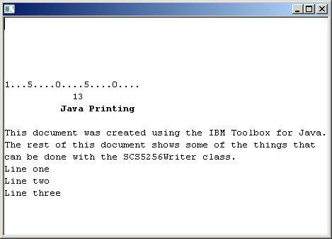
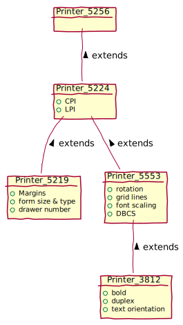

SCS Reader - Documentation
==========================
Martin W. Kirst <master_jaf@users.sourceforge.net>
v1.0, 2011-06


Abstract
--------
SCS Reader is an OSGI compatible Java library which is able to read,
parse and transform SCS (SNA Character String) data streams.
The implementation also offers some converters to transform such
streams into Text, PDF, RTF or other formats. At the current state
it supports all features of the SCS 5256 printer standard.

There are also renderer for Java Swing or Eclipse SWT available

### Screenshot

Example of a spool file within a SWT [StyledText](https://help.eclipse.org/2020-12/nftopic/org.eclipse.platform.doc.isv/reference/api/org/eclipse/swt/custom/StyledText.html) widget




Usage
-----
This project is designed to be an easy drop in replacement for 
projects with existing PDF view or export functionality.
The implementation design was inspired by the
[Java(TM) Streaming API for XML](http://jcp.org/en/jsr/detail?id=173)
Thus it's fast and very flexible. Additionally, one main
difference to any other implementation in this area is the fact,
that the SCS data streams pretty soon are converted
to Unicode and further processing
is all done in unicode. Therefore it's worthwhile to use this
library in multilingual environments.


Example Text-Printer
--------------------

```java
import java.io.File;
import java.io.FileWriter;

import net.scs.reader.EndOfFileSignal;
import net.scs.reader.IPrinterMicroCommand;
import net.scs.reader.IScsDataProvider;
import net.scs.reader.ReaderConfig;
import net.scs.reader.SCSStreamReader;
import net.scs.reader.dataprovider.As400ScsDataProviderFactory;
import net.scs.reader.virtualprinter.PrinterConfig;
import net.scs.reader.virtualprinter.TextPrinter;

import com.ibm.as400.access.SpooledFile;

public class ExampleTextPrinter {

	public static void main(String[] args) throws Exception {
		SpooledFile spooledFile = null; // TODO: provide your spool file!                                 <1>
		final IScsDataProvider dp = As400ScsDataProviderFactory.getPrintObjectDataProvider(spooledFile);
		final ReaderConfig rcfg = new ReaderConfig.Builder()
				.collectPrintableChars(true)
				.ignoreUnknownControlCodes(false)
				.ignoreNulls(false)
				.getConfig();
		final SCSStreamReader reader = new SCSStreamReader(dp, rcfg);

		PrinterConfig pcfg = PrinterConfig.getDefault();
		TextPrinter printer = new TextPrinter(pcfg);

		try {
			while (reader.hasNext()) {
				final IPrinterMicroCommand event = reader.next();
				if (event == null) break;
				printer.runMicroCommand(event);
			}
		} catch (EndOfFileSignal e) {
			System.out.println("eof.");
		}

		printer.finish();

		FileWriter fw = new FileWriter(new File("test.txt"));
		printer.writeText(fw);
		fw.close();
	}
}
```


Example PDF-Printer
--------------------

```java
import java.io.FileOutputStream;

import net.scs.reader.EndOfFileSignal;
import net.scs.reader.IPrinterMicroCommand;
import net.scs.reader.IScsDataProvider;
import net.scs.reader.ReaderConfig;
import net.scs.reader.SCSStreamReader;
import net.scs.reader.dataprovider.As400ScsDataProviderFactory;
import net.scs.reader.virtualprinter.PdfPrinter;
import net.scs.reader.virtualprinter.PrinterConfig;

import com.ibm.as400.access.SpooledFile;
import com.lowagie.text.Document;
import com.lowagie.text.Font;
import com.lowagie.text.FontFactory;
import com.lowagie.text.PageSize;
import com.lowagie.text.Rectangle;
import com.lowagie.text.pdf.BaseFont;
import com.lowagie.text.pdf.PdfWriter;

public class ExamplePdfPrinter {

	public static void main(String[] args) throws Exception {
		SpooledFile spooledFile = null; // TODO: provide your spool file!                                 <1>
		final IScsDataProvider dp = As400ScsDataProviderFactory.getPrintObjectDataProvider(spooledFile);
		final ReaderConfig rcfg = ReaderConfig.getDefault();
		final SCSStreamReader reader = new SCSStreamReader(dp, rcfg);

		PrinterConfig pcfg = PrinterConfig.getDefault();
		float FONT_SIZE = 9.0F;
		float leading = FONT_SIZE * 1.05F;
		
		// calculate font, font size, and margins for the PDF
		final Font monoSpacedFont = FontFactory.getFont(BaseFont.COURIER, FONT_SIZE);
		final Font monoSpacedFontBold = FontFactory.getFont(BaseFont.COURIER_BOLD, Font.BOLD);
		Rectangle pageSize = new Rectangle(PageSize.A4);
		final Document pdfdoc = new Document(pageSize);

		final FileOutputStream fos = new FileOutputStream("test.pdf");
		final PdfWriter pdfwriter = PdfWriter.getInstance(pdfdoc, fos);
		pdfdoc.open();
		
		PdfPrinter pdfprinter = new PdfPrinter(pcfg, pdfdoc, monoSpacedFont, monoSpacedFontBold, leading);
		
		try {
			while (reader.hasNext()) {
				final IPrinterMicroCommand event = reader.next();
				if (event == null) break;
				pdfprinter.runMicroCommand(event);
			}
		} catch (EndOfFileSignal e) {
			System.out.println("eof.");
		}
		
		pdfprinter.finish();
		pdfdoc.close();
		pdfwriter.close();
	}
```


Development
-----------

### Project Setup

SCS Reader was developed using Eclipse IDE.
Thus, the two plugins "net.scs.reader" and "unittest.net.scs.reader"
are independent Eclipse projects.


### Requirements

* Java v1.6+
* GIT, recommended as Eclipse-Plugin and command line tool
* Eclipse Helios (v3.6+)


### Dependencies

* JTOpen Framework v6.7+ (http://jt400.sourceforge.net/)
* iText v2.1.7 (http://itextpdf.com/)

NOTE: iText newer version 5.x is not yet supported


### Setup required libraries within Eclipse

1. You have to download the required libraries
2. Create a new java project called +wrapper-req-libs+
3. Create a new folder +lib+ within project +wrapper-req-libs+
4. Copy +iText.2.1.7.jar+ and +jt400.jar+ into the +lib+ folder
5. Go to properties of the wrapper project, go to 'build path' and go to 'order and export'
6. Check the two named libraries so that they get exported
7. Right-Click the wrapper project, click 'Configure' and click 'Convert to Plug-in projects'

Once you've converted the requiered 'JARs'
into a plugin project, your workspace should be error free and
you should be able to start hacking on this project.

### Additional Documentation

#### Feature sets per printer type, ordered/shown in hierarchical order



<div hidden>
```
@startuml

' title Feature sets per printer type, ordered/shown in hierarchical order

Object Printer_5256
Object Printer_5224
Object Printer_5219
Object Printer_5553
Object Printer_3812

Printer_5224 : +CPI
Printer_5224 : +LPI

Printer_5219 : +Margins
Printer_5219 : +form size & type
Printer_5219 : +drawer number

Printer_5553 : +rotation
Printer_5553 : +grid lines
Printer_5553 : +font scaling
Printer_5553 : +DBCS

Printer_3812 : + bold
Printer_3812 : + duplex
Printer_3812 : + text orientation

Printer_5256 -- Printer_5224 : < extends
Printer_5224 -- Printer_5219 : < extends
Printer_5224 -- Printer_5553 : < extends
Printer_5553 -- Printer_3812 : < extends

@enduml
```
</div>

